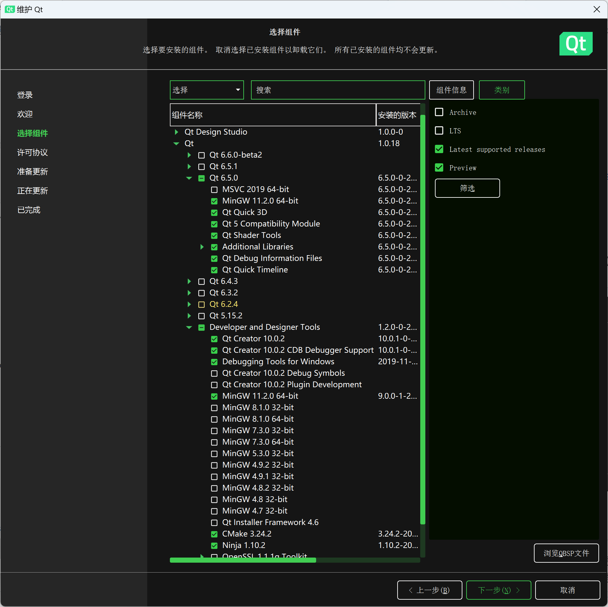

# 校科协C++组免试题

> ~~科普：什么是C++？~~《C++》是由贝尔实验室自主研发的一门古老的通用编程语言。程序运行在在一个被称作「C++抽象机」的机器上，在这里，被神选中的人将被授予「`auto`」，导引模板之力。你将扮演一位名为「程序员」的神秘角色，在自由的编码过程中邂逅性格各异、能力独特的编译器，和他们一起消灭bug，找回泄露的内存——同时，逐步发掘「UB」的真相。

免试题由三部分组成，分别是 **必做题**、**选做题**、**面试题**。必做题要求完成全部任务，选做题有一定难度，选择至少一个任务完成即可。在笔试之前 **通过必做题和选做题的验收以及面试**，就算免试题通过。

📂文件目录如下

```
exempt
├─choose
│ ├─coroutine
│ ├─TMP
│ └─CRTP
└─must
```

# 📋 必做题

> 📂`must/src` 文件夹下是一个已通过编译的Qt项目，它是C++组的WoC项目拆解出的删节代码。（因为魔改了一些代码的关系，如果在这个项目中发现了bug，你可以尝试修复它，也可以忍忍😖，**修复bug不在任务范围内**）

它是一款象棋游戏，在完成任务前请先仔细了解象棋规则，**尤其是输赢判断规则**。

## ✏️ 任务1：信号槽

实现认输功能：请在 `MainUI` 中添加按钮 `QPushButton`，点击按钮后调用 `MainUI::onWin` 槽函数。
 
**提示：** 注意区分是哪方胜利。

## ✏️ ️️️️任务2：️走棋逻辑

目前“马”的走棋逻辑还未实现，请尝试在 `ma.h` 的 `Ma::isBasicMove` 成员函数中完成“马”的正确走棋逻辑。

**提示：** `Algorithm` 工具类中有可能用到的辅助函数，阅读代码了解它们的用途后妥善使用以完成逻辑判断。注意“马脚”的判定。

### help

1. [Download Qt: Install and get started](https://www.qt.io/download-thank-you) 下载安装Qt6.2及以上版本。注册登录账号后选择以下组件安装：

1. 使用Qt Creator打开 `Chinese_Chess.pro` 文件，选择MinGW构建项目
2. 对函数名/变量名右键选择Find References to Symbol Under Cursor可以查找项目中使用到该函数/变量的地方
3. Qt是一套跨平台C++开发框架，其内容虽在标准C++之外，但都符合C++标准语法，不需要系统的额外学习，完成任务靠现学现卖。可以选择阅读[Qt官方文档](https://doc.qt.io)，也可以选择各种搜索引擎和学习网站进行学习
4. 我们的意图是让你大致了解Qt（最重要的是信号槽机制），并考察阅读理解项目代码的能力

# 📒 选做题

**任务难度与顺序无关** ，这里的任务都是考察对标准库的掌握程度。完成任务需要掌握C++98的基本知识，并通过阅读我们提供的帮助文档，学习C++新版本的知识，完成demo。

## 📌 任务1：猜数字

* 本题出题者 **@Serein** 有问题可以联系QQ:2075337935

> 这并不是一个简单的猜数字！  
> 这并不是一个简单的猜数字！  
> 这并不是一个简单的猜数字！

### ⭐ 题目要求

项目在 📂`choose/coroutine` 文件夹下。

这是一个使用C++20协程的猜数字小游戏，**需要根据已有代码推测意图，并在规定处补全代码，使程序能够正常执行**。

### help

1. 程序使用C++20的语法，由于版本较新，推荐使用Visual Studio 2022 v17.4.5以上版本查看源码，并确保将C++标准调整至C++20或以上。
2. 项目使用CMake管理代码，请使用VS打开 `CMakeLists.txt` 以打开项目。
3. 推荐阅读《C++ Primer》第1-7、15章
4. `choose/coroutine.pdf` 会帮助你学习协程的基本知识。

## 📌 任务2：模板元编程
- 本题出题者 **@594飞飘** 有问题可以联系QQ:445785526

### 前言
>C++模板元编程(C++ Template Meta Programming，TMP)，通常来说是指利用模板控制编译器产生临时源代码的技术。

大家都说拿着模板正常用就是模板编程，魔怔着用就是模板元编程(bushi)  
对于C++新手来说，TMP显然是晦涩难懂的，大家尽力而为

### ⭐ 题目要求

**要求填充给定的代码，以实现一个编译期欧拉函数序列**

>学过数论的应该会很熟悉欧拉函数，他是一个定义在整数集上的函数phi(N)，其值为从1到N，N个数字中与N互质的数的个数

定义`EulerFunctionList<N>::value`是值为`{phi(1),phi(2)...phi(N)}`，长度为N，类型为`int`的数组

**输出示例**

修改N的数值为10，程序将输出
```
1 2 2 4 2 6 4 6 4 10 4 12 6 8
```

### ❗注意
- 代码文件在📂`choose/TMP/eulerfunction.cpp`
- 注意，N无需过大，虽然答案示例程序N可以为5000，但你**只需超过30**即可，否则很容易超出迭代限制，你懂的 
- 出题人的blog还是很有用的，被组长说夹带私货了呜呜呜
- 视完成度给分，大致踩分为
    1. 完成欧拉函数判断部分
    2. 完成序列生成器部分

### help

1. 一个总体的模板元编程初级教学的链接，来自知乎 https://zhuanlan.zhihu.com/p/378355217
2. 来自 **@594飞飘** 的blog，标题写的就是c++模板元编程，不断更新，主要写一点模板元编程的思路 https://feipiao594.github.io/posts/9244e40f.html
3. 来自 **@594飞飘** 的blog，编译器质数序列生成器，没有优化，但是是一个能跑的例子(乐) https://feipiao594.github.io/posts/3187765d.html
4. 使用`enable_if_t`实现分支选择
5. 还想要更多嘛，可以看看`cppcon`，或者google一下哦
6. 请使用C++14标准的`constexpr`函数，与C++17标准的`constexpr if`

>等到免试题全部结束，将会在 **@594飞飘** 的blog内公布我本人写的答案，并且在授课时会讲这个题，我尽量优化QAQ

## 📌 任务3：奇异递归


# ❓Q&A

🔹**题目看不懂不会做怎么办？**  
也许草草翻下来一头雾水，也许做了几天一无进展，但不必灰心。耐心阅读帮助文档，理解项目代码的意图。我们希望你能通过免试题学习到一些东西。

🔹**我是小白，能完成免试题吗？**  
萌新可以从学习C++的基础知识开始哦。群文件中上传了《C++ Primer》PDF，浏览一下《C++ Primer》或者bing一下，大概看看编程是怎么回事，通过是没有问题的😀。

🔹**任何问题请找我 QQ: 2075337935（选做题有问题请找出题人**   
我们还是很鼓励有问题来问的😁。

# ✔️ 验收

将整个项目文件夹📂`exempt` 压缩为 `学号姓名.zip` 文件，发送到QQ:2075337935