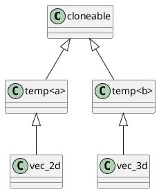

# Problem B3
We have provided a baseline project for you. You should compile it successfully with any modern C++ compiler that supports Standard C++ 17. We assume that you have the ability to configure the programming environment, since you are trying to pass the enrollment assessment via the exemption channel.

## Warning
- You MUST not use advanced preprocessor tricks. We are going to examine your Modern C++ ability, not your preprocessor ability.
- You MUST do the tasks as the problem describes. We are going to examine your ability to solve the problem under certain method, not your creativity.
- You MUST not use any third-party library. We are going to examine your ability to solve the problem with Standard C++ 17, not your ability to use third-party library.

## License
The baseline project is licensed under the MIT License, you can feel free to use it. 

But your modified version should at least licensed for SAST to use, modify, and distribute freely if you are to sumbit to SAST's enrollment program.

## Task 1
In the baseline project, we have a pure-abstract class named `cloneable`. We implement it in class `vec_2d` and `vec_3d` respectively. Now please remove these implementations and create a super class to implement the method. Idealy, we can get `cloneable` implemented just by adding a super class to `vec_2d` and `vec_3d`.

Tips: you may use the following structuct:


## Task 2
In the baseline project, we've implemented unary operator `+=`, `-=`, `*=`, `/=` for `vec_2d` and `vec_3d`. Now write a universal super class to implement `+`, `-`, `*` and `/` for `vec_2d` and `vec_3d`. Note that we do not require a runtime polymorphism. I just mean that you need to write something and then we can implement these binary operators just by adding something into the list of super classes.

## Task 3
Li Hua has found that the memory usase increases as the time goes by. But he cannot find where memory leaks after he reads the code carefully. He need some utility to help him debug the shit-like code. Please write a simple Object Counter to assist him.

### Required
- For any existed class, if you are going to trace the count of how many the instances have been created, you are just required to add something into the list of super classes.
- The statistics should be independent for each different class.

### Idealy way to use
```cpp
class vec_2d : need_object_counter<...> {
};

int main()
{
    do_something();
    std::cout 
      << "Leaky Vec 2D Objects (Count): " 
      << object_counter<vec_2d>::get() 
      << std::endl;
}
```