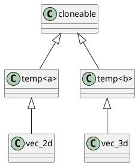

# 问题 B3
我们为您提供了一个基准项目。您应该使用任何支持标准 C++ 17 的现代 C++ 编译器成功编译它。我们假设您有配置编程环境的能力，因为您正通过豁免渠道参加招新评估。

## 警告
- 您绝对不可以使用高级预处理技巧。我们将检验您的现代 C++ 能力，而不是您的预处理能力。
- 您必须按照问题描述执行任务。我们将检验您在特定方法下解决问题的能力，而不是您的创造力。
- 您绝对不可以使用任何第三方库。我们将检验您使用标准 C++ 17 解决问题的能力，而不是您使用第三方库的能力。

## 许可证
基准项目基于 MIT 许可证发布，您可以免费使用它。

但如果您要提交给 SAST 的招新计划，您的修改版本至少应当授权 SAST 自由使用、修改和分发的权利。

## 任务 1
在基准项目中，我们提供了一个名为 `cloneable` 的纯虚类。我们在类 `vec_2d` 和 `vec_3d` 中分别实现了它。现在请移除这些实现，并创建一个超类来实现该方法。理想情况下，我们只需为 `vec_2d` 和 `vec_3d` 添加一个超类，就可以实现 `cloneable`。

提示：您可以使用以下结构：


## 任务 2
在基准项目中，我们已为 `vec_2d` 和 `vec_3d` 实现了一元运算符 `+=`、`-= `、`*=` 和 `/=`。现在，请编写一个通用的超类，以实现 `vec_2d` 和 `vec_3d` 的 `+`、`-`、`*` 和 `/` 运算符。请注意，我们不需要运行时多态性。我只是表示您需要编写一些代码，然后我们可以通过将一些东西添加到超类列表中来实现这些二元运算符。

## 任务 3
李华发现随着时间的推移，内存使用量在增加，但在仔细阅读代码后，他找不到内存泄漏的地方。他需要一些工具来帮助他调试这种像屎一样的代码。请编写一个简单的对象计数器来辅助他。

### 要求
- 对于任何已存在的类，如果您要追踪已创建的实例数量，只需将一些内容添加到超类列表中即可。
- 统计应对每个不同的类独立进行。

### 理想用法
```cpp
class vec_2d : need_object_counter<...> {
};

int main()
{
    do_something();
    std::cout 
      << "Leaky Vec 2D Objects (Count): " 
      << object_counter<vec_2d>::get() 
      << std::endl;
}
```